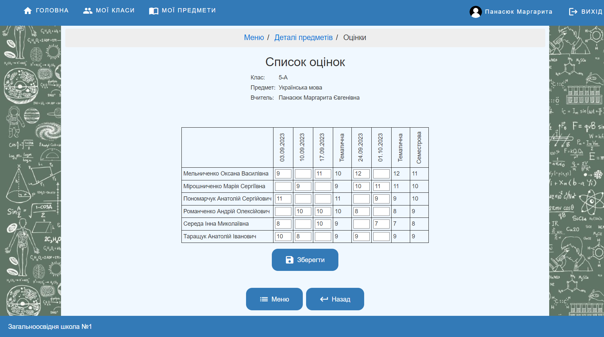
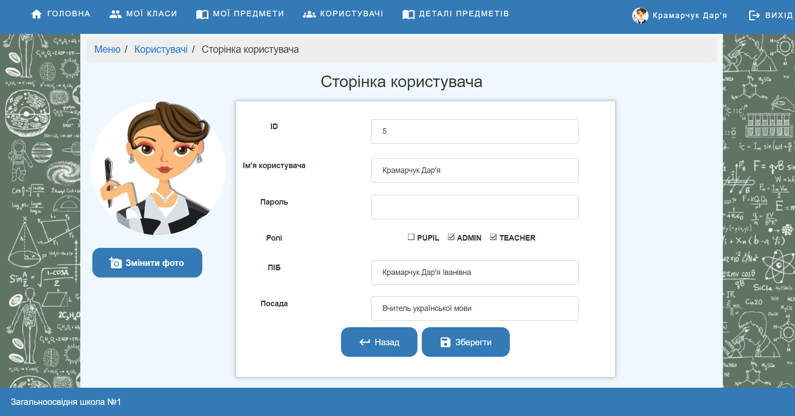

# Gradebook

Gradebook is an online journal application developed using the Spring framework. It serves as a digital gradebook for school students. The application uses a PostgreSQL database and is deployed on the Weblogic web server.

## Reasons for Development

This project was initially developed as a laboratory work during the Java development courses. Over time, it was further refined and expanded, eventually evolving into a Bachelor's thesis project.

## Features

  - User authentication: Students, teachers, and administrators can create accounts and log in to the application.
  - Role-based access control: Different roles (student, teacher, administrator) have different permissions within the application.
  - Administrator functionality:
      - Manage academic year, semester, subjects, and classes.
      - Add students to classes.
      - Assign roles to users.
      - Assign teachers to subjects for specific classes and semesters.
  - Teacher functionality:
      - Add topics and lessons to subjects.
      - Grade students' assignments.
      - Mark attendance for students
  - Student functionality:
      - View own grades for different subjects and assignments.

## Technologies Used

  - Java
  - Spring framework
  - PostgreSQL
  - Weblogic web server

## Prerequisites

Before getting started with the Gradebook application, ensure that you have the following prerequisites:

  - Java Development Kit (JDK) installed on your system.
  - Apache Maven for building and managing dependencies.
  - PostgreSQL database server installed and running.
  - Weblogic web server set up and configured.
  - A modern web browser to access the application. 

## Getting Started

To get a local copy of the Gradebook application up and running, follow these steps:

 1. Clone this repository: `git clone https://github.com/marharita08/Gradebook`.
 2. Create database for the application.
 3. Configure `src/main/resources/datasource.properties` with following properties:

   | Property                 | Description                                               |
   |--------------------------|-----------------------------------------------------------|
   | domain.name              | The name of the domain where the application is deployed  |
   | admin.username           | The username for accessing the administration console     |
   | admin.password           | The password for accessing the administration console     |
   | admin.url                | The URL of the administration console                     |
   | app.name                 | The name of the application                               |
   | datasource.name          | The name of the datasource                                |
   | datasource.database.name | The name of the database associated with the datasource   |
   | datasource.target        | The target server or cluster for the datasource           |
   | datasource.filename      | The name of the configuration file for the datasource     |
   | datasource.jndiname      | The JNDI name for the datasource                          |
   | datasource.driver.class  | The fully qualified class name of the datasource driver   |
   | datasource.url           | The URL for connecting to the database                    |
   | datasource.username      | The username for accessing the database                   |
   | datasource.password      | The password for accessing the database                   |
   | datasource.test.query    | The SQL query used to test the database connection        | 

 4. Run `build.cmd` or `./build.sh` depending on your OS.
 5. Download [JDBC Driver for PostgreSQL](https://jdbc.postgresql.org/download/). Place driver into `domain_name/lib` folder (by default `base_domain/lib`).
 6. Start Weblogic.
 7. Run `initDataSource.cmd` or `./initDataSource.sh`.
 8. Run `deploy.cmd` or `./deploy.sh`.
 9. Access the application in your web browser at `http://localhost:7001/Gradebook`.

## Screenshots

